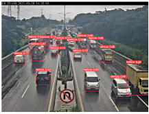
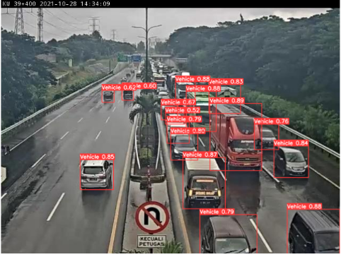
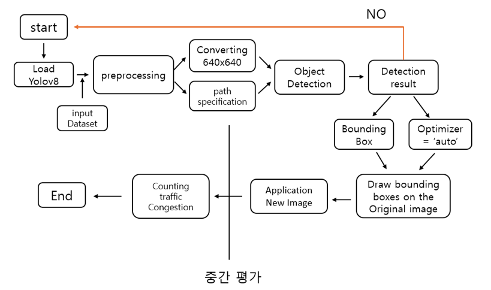
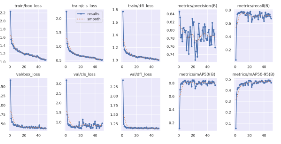

# YOLOv8n_Traffic_congestion_Check
## Yolov8을 이용해서 객체를 탐지하여 교통 혼잡도 체크하기
---

CCTV와 같은 차도 영상을 이용하여 교통 혼잡도를 측정하는 시스템, 교통카메라의 실시간 교통영상을 활용하여
차량 객체를 탐지하여 임계치를 설정하고 Low,Middle,High 범주로 화면 상단에 표시한다. 
이를 통해 내가 원하는 지역의 교통 혼잡도를 파악하여 혼잡도가 높은 지역을 피해 경로를 짜서 교통체증의 스트레스를 줄일 수 있다

**현 프로젝트의 문제점**

1.영상을 일일히 넣어 혼잡도를 파악하고자하는 곳의 좌표값을 찾아야함

2.작은 객체들은 탐지하기 힘듦

3.임계치값을 이미 정의하여 유동적 확인 불가

**추후개선사항**

1.앱이나 웹에 연결하여 실시간 영상을 통해 쉽게 교통혼잡도 파악 가능

2.영상 속 차선의 갯수를 통해 임계값 유동적 변경

3.작은 객체도 탐지 원할하게 개선

## 📚사용 라이브러리 및 기술

   
---
      

**사용한 데이터셋**
rovoflow 내 데이터 셋 : 2개

https://universe.roboflow.com/farzad/vehicle_detection_yolov8/dataset/3
https://universe.roboflow.com/sxc/traffic-congestion-detection/dataset/9/images

## 모델 선정이유
---
고준형. "차량 객체 탐지를 위한 딥러닝 모델 성능 비교 분석." 국내석사학위논문 경기대학교 대학원, 2022. 경기도
논문에서 실시간 객체 탐지에서 CenterNet이 적합하다 하지만 YOLO가 적은 데이터량으로도 최적의 성능에 도달하고 데이터 셋 불균형 해소를 해결해주기도하고 Yolov8에서는 실시간 객체 탐지 성능 또한 향상되었기때문에 YOLO로 선정하였다 

## flowChart

## 구현 내용
---
### Yolov8로 Vehicle 객체 Detection하고 인식 범위 지정한 후 이미지 좌표를 이용하여 범위 지정하여 지정된 범위내에 있는 탐지된 객체 수 세어 교통 혼잡도 알려준다

**학습 결과 지표**

### ⛔트러블 슈팅!!

https://github.com/arthur1597/YOLOv8n_Traffic_congestion/assets/135976261/75eb63a3-6d9d-4b43-b31c-2834c069d6b7

하이퍼파라미터 조정 등 여러가지 방법을 해보았지만 결국
--> 데이터셋 추가로 해결

https://github.com/arthur1597/YOLOv8n_Traffic_congestion/assets/135976261/52a3abcf-e6e8-4207-a944-2e37a93f4bf5

## 최종 결과
---

https://github.com/arthur1597/YOLOv8n_Traffic_congestion/assets/135976261/d1a9f50c-6a01-4fb9-8308-61d6d24e2466

